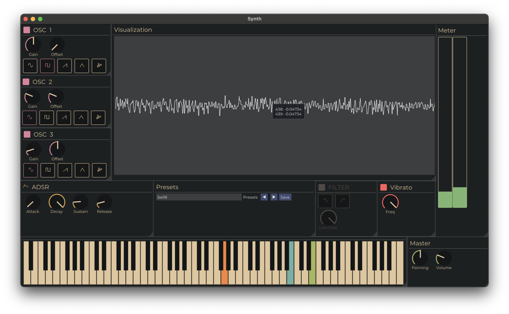

# Synth

Cross-platform synthesier written in C++

## Libs

- [PortAudio](https://github.com/PortAudio/portaudio)
- [ImGui](https://github.com/ocornut/imgui)

## How To Build

1. Install [cmake](https://cmake.org)
2. clone repository: `git clone --recurse-submodules https://github.com/olexenn/Synth`
3. `mkdir build && cd build`
4. `cmake ..`

## TODO

- [ ] Refactor UI
- [ ] Add MIDI Support
- [ ] Add Notes editor
